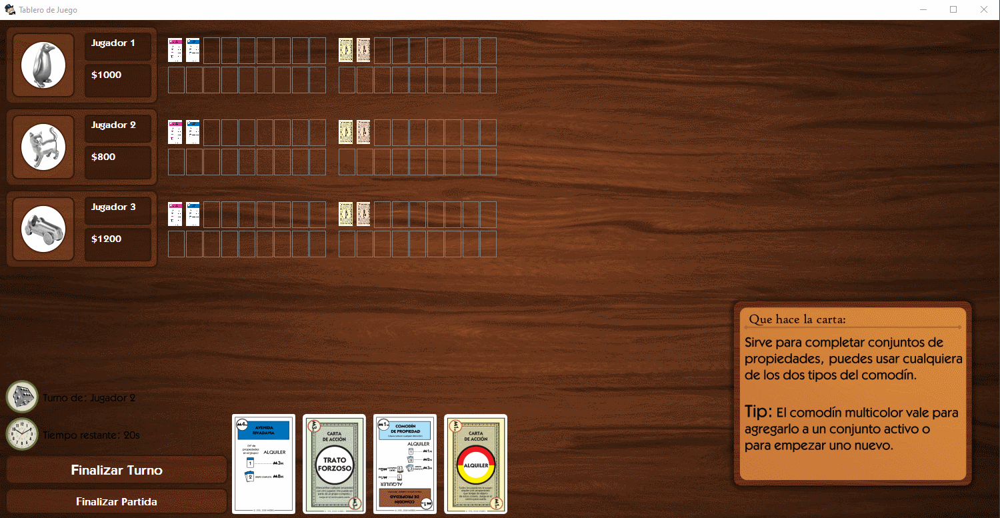

# **Grupo5 - MonopolyDeal** 🎮

Este es nuestro Trabajo Grupal Final de Programación Orientada a Objetos (POO).
Elegimos recrear el juego de cartas "Monopoly Deal" aplicando Patrones de diseño y una base de datos.


## Integrantes del grupo 🙋‍♂️ 
- [@FrancoGCardenas](https://github.com/FrancoGCardenas)
- [@LucasBonifacio](https://github.com/lucasub360)
- [@DiegoVidal](https://github.com/VidalDiegoo)
- [@CarlosLopes](https://github.com/carlitoslopes)
- [@DahianaWilliams](https://github.com/dahiwms)
- [@NadinGonzalez](https://github.com/nadinMG)
- [@HugoOsvaldoBarrera](https://github.com/colo1413)

## 📚 Universidad 
Este proyecto fue desarrollado como parte de la materia **Programación Orientada a Objetos (POO)** en la **Universidad Nacional de la Patagonia San Juan Bosco (UNPSJB)**, sede Comodoro Rivadavia.

## Monopoly Deal Preview Gameplay


## Características Técnicas

- Implementamos el **Patrón de Diseño MVC (Modelo-Vista-Controlador)**, asegurando:
  - **Separación de responsabilidades**: Lógica, interfaz y el control están separados, para facilitar la escalabilidad y el mantenimiento.
  - Realizado con la estructura de código más organizadas posible.


## Características Artísticas
- Esta es una versión adaptada del **Monopoly Deal**, usando nuestra propia temática basada en la ciudad de **Comodoro Rivadavia**.
- **Diseño único**: Las cartas las diseñamos desde 0, con menciones de calles y avenidas de la ciudad.
- Nuestro enfoque principal es darles una experiencia:
  - ✔**Funcional**
  - ✔**Atractiva**
  - ✔**Intuitiva** (Asegurandonos que los usuarios tengan una experiencia lo más cercana al Monopoly Deal original).


## 🔸 VERSION DE PYTHON: [3.12.5]
## 🔸Paquetes y librerias utilizadas 

```bash
  - Pyqt6 
  - psycopg2 
  - hashlib
```